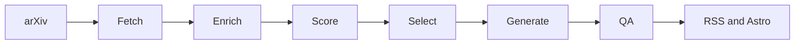

# AI Research Brief / AI 研究简报

A reproducible AI paper brief system. It implements a Python data pipeline and an Astro static site for AI paper collection, scoring, transparent source pages, daily briefs, bilingual content, RSS, archive, search, and scheduled automation.

The project only reproduces product capabilities and information architecture. It does not copy third-party brand, text, style, logo, domain, or original content.

## Features

- Python 3.11 pipeline with Pydantic models.
- arXiv collection for AI-related categories.
- Optional external signal enrichment with graceful fallback.
- Configurable scoring and topic classification.
- Mock mode that runs without any private keys.
- Chinese and English Markdown generation.
- Source transparency pages with score breakdowns.
- RSS, sitemap and static search index.
- Astro static website.
- Scheduled workflow automation.

## Architecture



## Quick start

```bash
python -m venv .venv
source .venv/bin/activate
pip install -r requirements.txt -e .
ai-brief mock-run
pytest
cd apps/web
npm install
npm run build
```

## Commands

```bash
ai-brief fetch --date 2026-06-03
ai-brief enrich --date 2026-06-03
ai-brief score --date 2026-06-03
ai-brief generate --date 2026-06-03 --lang zh
ai-brief generate --date 2026-06-03 --lang en
ai-brief build-content --date 2026-06-03
ai-brief run-daily --delay-days 3
ai-brief qa --date 2026-06-03
ai-brief mock-run
```

## Configuration

Configuration files live in `configs/`. Prompt templates live in `packages/prompts/`. Generated content lives in `data/content/`. The static website lives in `apps/web/`.

## Disclaimer

Generated briefs are for information triage only. They are not final academic evaluation, investment advice, or proof of production readiness. Read original papers before relying on any claim.
