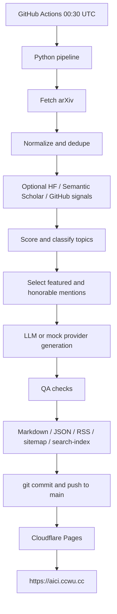

# AI Research Brief / AI 研究简报

AI Research Brief is a reproducible AI paper briefing system. It collects AI-related arXiv papers, optionally enriches them with public signals, scores and selects papers, generates bilingual daily briefs, publishes transparent source pages, and builds an Astro static site for Cloudflare Pages.

The project learns from the information architecture of daily AI paper brief products, but does not copy any third-party brand, copy, visual design, logo, domain, trademark, or original content.

## Features

- arXiv Atom API collection for `cs.AI`, `cs.CL`, `cs.LG`, `cs.CV`, `cs.MA`, `cs.IR`.
- Optional Hugging Face, Semantic Scholar, and GitHub signal enrichment.
- Configurable 12-part scoring system with per-paper score breakdowns.
- Topic classification, diversity-aware selection, and T+3 publishing cadence.
- Mock provider and mock data so the full pipeline runs without API keys.
- OpenAI-compatible provider support for OpenAI, DeepSeek, and OpenRouter.
- Chinese and English Markdown briefs plus source transparency pages.
- RSS, sitemap, and static search index generation.
- Astro static site with home, daily, archive, topics, search, methodology, what's new, privacy, and RSS routes.
- GitHub Actions scheduled generation, tests, build, commit, push, and optional notifications.

## Architecture



## Local Quick Start

```bash
cd /Users/wangzheng/Documents/vibecoding/ai_research
python -m venv .venv || true
source .venv/bin/activate
python -m pip install --upgrade pip
pip install -r requirements.txt -e .
ai-brief mock-run
pytest -q
cd apps/web
npm install
npm run build
```

## Mock Run Demo

`mock-run` is deterministic, offline-friendly, and requires no API keys:

```bash
ai-brief mock-run
ai-brief mock-run --date 2026-06-03
```

It generates:

- `data/content/{zh,en}/daily/*.md`
- `data/processed/YYYY-MM-DD/*.json`
- `data/reports/qa/YYYY-MM-DD.json`
- `apps/web/public/{zh,en}/feed.xml`
- `apps/web/public/sitemap.xml`
- `apps/web/public/search-index.json`

## Real arXiv Collection

```bash
ai-brief run-daily --delay-days 3
ai-brief fetch --date 2026-06-03
ai-brief enrich --date 2026-06-03
ai-brief score --date 2026-06-03
ai-brief build-content --date 2026-06-03
ai-brief qa --date 2026-06-03
```

Production runs query arXiv for the target date. If arXiv fails or returns no candidates, the command fails instead of silently publishing mock content. Use `ai-brief mock-run` only for local demo and CI manual mock mode.

## LLM Configuration

Default:

```bash
export LLM_PROVIDER=mock
```

OpenAI-compatible options:

```bash
export LLM_PROVIDER=openai
export OPENAI_API_KEY=...
export OPENAI_BASE_URL=https://api.openai.com/v1
export OPENAI_MODEL=gpt-4o-mini
```

DeepSeek:

```bash
export LLM_PROVIDER=deepseek
export DEEPSEEK_API_KEY=...
```

OpenRouter:

```bash
export LLM_PROVIDER=openrouter
export OPENROUTER_API_KEY=...
```

If a configured LLM call fails, generation falls back to rule-based text so the daily job does not stop on model API volatility.

## External Signals

External enrichment is off by default:

```bash
export AI_RESEARCH_EXTERNAL_SIGNALS=1
```

Optional keys:

```bash
export SEMANTIC_SCHOLAR_API_KEY=...
export GITHUB_API_TOKEN=...
```

`GITHUB_TOKEN` is also accepted. Without keys, Semantic Scholar and authenticated GitHub enrichment are skipped. Basic code-link detection only trusts explicit GitHub URLs present in paper text.

## GitHub Secrets

Recommended repository secrets for unattended runs:

```text
LLM_PROVIDER
OPENAI_API_KEY
OPENAI_BASE_URL
OPENAI_MODEL
DEEPSEEK_API_KEY
OPENROUTER_API_KEY
ANTHROPIC_API_KEY
SEMANTIC_SCHOLAR_API_KEY
GITHUB_TOKEN
AI_RESEARCH_EXTERNAL_SIGNALS
TELEGRAM_BOT_TOKEN
TELEGRAM_CHAT_ID
RESEND_API_KEY
MAIL_FROM
MAIL_TO
SITE_URL
```

No secret is required for `mock-run`. Without notification secrets, the notification scripts print `missing config, skipped` and exit successfully.

## Generate Daily Briefs

```bash
ai-brief run-daily --date 2026-06-03
ai-brief run-daily --delay-days 3
ai-brief generate --date 2026-06-03 --lang zh
ai-brief generate --date 2026-06-03 --lang en
ai-brief build-content --date 2026-06-03
```

## Build the Astro Site

```bash
cd apps/web
npm install
npm run build
npm run dev
```

The static output is `apps/web/dist`.

## GitHub Actions Automation

`.github/workflows/daily-brief.yml` runs every day at UTC 00:30, which is 08:30 in Beijing/Taipei time. It:

1. Installs Python 3.11 and Node 22.
2. Installs `requirements.txt` and the editable package.
3. Runs `ai-brief run-daily --delay-days 3` or `ai-brief mock-run` for manual mock dispatch.
4. Runs `pytest -q`.
5. Builds Astro.
6. Commits generated `data/` and `apps/web/public/` artifacts.
7. Pushes to `main`.
8. Optionally sends Telegram and Resend email notifications.

Cloudflare Pages should watch the `main` branch and deploy after the push.

## Cloudflare Pages Deployment

Recommended Pages settings:

```text
Project: ai-research
Production branch: main
Root directory: apps/web
Build command: npm install && npm run build
Build output directory: dist
```

If Root directory is blank, use:

```text
Build command: cd apps/web && npm install && npm run build
Build output directory: apps/web/dist
```

This repository is optimized for the recommended `apps/web` root directory.

## Domain Check: aici.ccwu.cc

In the Cloudflare dashboard, open:

```text
Pages > ai-research > Custom domains
```

Confirm:

- `aici.ccwu.cc` is attached to the `ai-research` Pages project.
- DNS status is active.
- Certificate status is active or pending validation.
- Latest production deployment is from branch `main`.

If `/zh/` works but RSS is 404, confirm `apps/web/public/zh/feed.xml` was committed and the Pages output directory is correct. If the site is 404, confirm the production branch and build output directory. If the certificate is pending, wait for Cloudflare validation and recheck DNS.

More detail: [docs/deploy-cloudflare.md](docs/deploy-cloudflare.md).

## Optional Email and Telegram Sending

Telegram:

```bash
export TELEGRAM_BOT_TOKEN=...
export TELEGRAM_CHAT_ID=...
export SITE_URL=https://aici.ccwu.cc
python scripts/notify_telegram.py
```

Email through Resend:

```bash
export RESEND_API_KEY=...
export MAIL_FROM=brief@example.com
export MAIL_TO=you@example.com
export SITE_URL=https://aici.ccwu.cc
python scripts/send_email.py
```

Missing variables cause scripts to skip and exit successfully.

## Why Workers KV Is Not Needed Now

Current project does not need Workers KV.

1. Content is statically generated and committed to GitHub.
2. Cloudflare Pages deploys the static Astro site.
3. Daily state is tracked in `data/processed/YYYY-MM-DD`.
4. Notification state can initially be inspected through GitHub Actions logs and generated JSON.

Future user subscriptions, send-state storage, online APIs, reading state, or admin dashboards may justify Cloudflare KV, D1, or R2. If a strong-consistency subscription system is needed, evaluate Cloudflare D1 before KV.

## Data Directories

- `data/raw/`: raw fetched paper records.
- `data/processed/`: normalized papers, signals, scores, and selected papers.
- `data/content/`: generated bilingual Markdown briefs and source pages.
- `data/reports/`: QA reports.
- `data/mock/`: reserved for mock fixtures.

## Scoring Rules

The score combines:

1. top institution background
2. HF Daily Papers recommendation
3. HF upvote heat
4. top conference signal
5. code availability
6. practitioner keywords
7. Semantic Scholar citations
8. GitHub open-source heat
9. arXiv category weight
10. novelty or duplicate penalty
11. recent topic repeat penalty
12. safety, ethics, and governance keywords

Every scored paper writes `total_score`, `score_breakdown`, `selected_reason`, `matched_keywords`, `confidence_level`, and `topic`.

## Content Principles

- Neutral, restrained, and source-grounded.
- Explain problem, method, and significance in that order.
- Do not turn arXiv preprints into verified peer-reviewed conclusions.
- Do not invent code links.
- Do not inflate small benchmark results.
- Do not treat demos as production systems.
- Do not provide investment advice.

## Quality Checks

`ai-brief qa --date YYYY-MM-DD` checks frontmatter, arXiv links, source pages, score breakdowns, generated static files, processed JSON, forbidden wording, code-link integrity, bilingual presence, RSS, sitemap, and search-index fields.

QA errors fail the CLI and GitHub Actions. Warnings are reported but do not fail by default.

## FAQ

**Why T+3?** It gives community and repository signals time to appear while still keeping the brief recent.

**Can it run without keys?** Yes. `mock-run` is keyless; production runs can use arXiv-only data when optional enrichers are disabled.

**What happens when arXiv is unavailable?** Production generation fails clearly and does not publish mock content.

**Where are prompts?** Prompt templates are in `packages/prompts/`.

**Can Cloudflare deploy from the generated content only?** Yes. The Pages project builds the Astro site from committed content and public artifacts.

## Roadmap

- Better full-paper extraction when PDFs are available.
- Stronger external signal matching.
- Subscriber management and send-state tracking.
- Optional KV/D1/R2 once dynamic product features exist.
- More topic-level trend analytics.

## Disclaimer

AI Research Brief is an automated research triage tool. It is not peer review, legal advice, medical advice, financial advice, or investment advice. Always read the original paper before relying on a claim.
