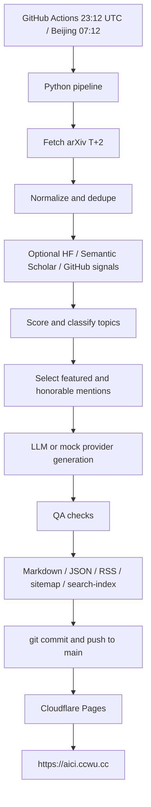

# AI Research Brief / AI 研究简报

AI Research Brief is a reproducible AI paper briefing system. It collects AI-related arXiv papers, optionally enriches them with public signals, scores and selects papers, generates bilingual daily briefs, publishes transparent source pages, and builds an Astro static site for Cloudflare Pages.

The project learns from the information architecture of daily AI paper brief products, but does not copy any third-party brand, copy, visual design, logo, domain, trademark, or original content.

## Website and WeChat / 网站与公众号

- Website / 网站: https://aici.ccwu.cc/
- WeChat Official Account / 微信公众号: 灵感与观点交流

<p align="left">
  
</p>

## Publishing Cadence / 发布节奏

- Daily schedule: **07:12 Beijing/Taipei time**.
- Cron schedule: **23:12 UTC** on the previous UTC day.
- Data cadence: **T+2**. Each production run normally covers arXiv papers from two Beijing/Taipei calendar days earlier.
- Example: a run at Beijing/Taipei **2026-06-05 07:12** normally generates the **2026-06-03** AI research brief.
- If the T+2 date has no usable arXiv papers in the configured categories, the job searches backward up to `pipeline.fallback_days` days and records `target_date`, `actual_date`, and `fallback_from`.
- Production real mode never publishes mock papers as real content.

## Coverage / 技术方向

The selection rules are still score-first and source-grounded. The daily paper pool covers, but is not limited to:

- Agent
- reasoning / 推理
- training optimization / 训练优化
- retrieval and RAG / 检索与 RAG
- multimodal / 多模态
- code intelligence / 代码智能
- vision and image generation / 视觉与图像生成
- video generation / 视频生成
- safety and alignment / 安全与对齐
- speech and audio / 语音与音频
- robotics / 机器人
- interpretability / 可解释性
- benchmarks and evaluation / 基准与评测
- data engineering / 数据工程
- industry signals / 行业动态

## Features

- arXiv Atom API collection for `cs.AI`, `cs.CL`, `cs.LG`, `cs.CV`, `cs.MA`, `cs.IR`.
- Optional Hugging Face, Semantic Scholar, and GitHub signal enrichment.
- Configurable 12-part scoring system with per-paper score breakdowns.
- Topic classification, diversity-aware selection, T+2 publishing cadence, and safe fallback to the nearest recent arXiv data date.
- Mock provider and mock data so the full pipeline runs without API keys.
- OpenAI-compatible provider support for OpenAI, DeepSeek, and OpenRouter.
- Chinese and English Markdown briefs plus source transparency pages.
- RSS, sitemap, and static search index generation.
- Astro static site with home, daily, archive, topics, search, methodology, what's new, privacy, and RSS routes.
- GitHub Actions scheduled generation, tests, build, commit, push, and optional notifications.

## Architecture



## Local Quick Start

```bash
python -m venv .venv || true
source .venv/bin/activate
python -m pip install --upgrade pip
pip install -r requirements.txt -e .
ai-brief mock-run
pytest -q
cd apps/web
npm install
npm run build
```

## Real arXiv Collection

```bash
ai-brief run-daily --delay-days 2
ai-brief run-daily --delay-days 2 --fallback-days 4
ai-brief run-daily --date 2026-06-03 --fallback-days 4
ai-brief fetch --date 2026-06-03
ai-brief enrich --date 2026-06-03
ai-brief score --date 2026-06-03
ai-brief build-content --date 2026-06-03
ai-brief qa --date 2026-06-03
```

Production runs query arXiv for the target date. The default target is T+2: today in Beijing/Taipei time minus `pipeline.delay_days` from `configs/site.yaml`, currently 2 days. If that target date has no real arXiv papers in the configured categories, `run-daily` searches backward up to `pipeline.fallback_days`, currently 4 days, and uses the nearest date with real arXiv data.

Brief and source pages record both `target_date` and `actual_date`; fallback pages also record `fallback_from`. If every fallback date has no real papers, or every arXiv category fails, the command fails clearly and does not publish mock content. Use `ai-brief mock-run` only for local demo, CI validation, and manual mock workflow runs.

## LLM Configuration

Default:

```bash
export LLM_PROVIDER=mock
```

OpenAI-compatible options:

```bash
export LLM_PROVIDER=openai
export OPENAI_API_KEY=...
export OPENAI_BASE_URL=https://api.openai.com/v1
export OPENAI_MODEL=gpt-4o-mini
```

DeepSeek:

```bash
export LLM_PROVIDER=deepseek
export DEEPSEEK_API_KEY=...
```

OpenRouter:

```bash
export LLM_PROVIDER=openrouter
export OPENROUTER_API_KEY=...
```

If a configured LLM call fails, generation falls back to rule-based text so the daily job does not stop on model API volatility.

## External Signals

External enrichment is off by default:

```bash
export AI_RESEARCH_EXTERNAL_SIGNALS=1
```

Optional keys:

```bash
export SEMANTIC_SCHOLAR_API_KEY=...
export GITHUB_API_TOKEN=...
```

`GITHUB_TOKEN` is also accepted. Without keys, Semantic Scholar and authenticated GitHub enrichment are skipped. Basic code-link detection only trusts explicit GitHub URLs present in paper text.

## GitHub Secrets

Recommended repository secrets for unattended runs:

```text
LLM_PROVIDER
OPENAI_API_KEY
OPENAI_BASE_URL
OPENAI_MODEL
DEEPSEEK_API_KEY
OPENROUTER_API_KEY
ANTHROPIC_API_KEY
SEMANTIC_SCHOLAR_API_KEY
AI_RESEARCH_EXTERNAL_SIGNALS
TELEGRAM_BOT_TOKEN
TELEGRAM_CHAT_ID
RESEND_API_KEY
MAIL_FROM
MAIL_TO
SITE_URL
CLOUDFLARE_PAGES_DEPLOY_HOOK
```

No secret is required for `mock-run`. Without API keys, the default `LLM_PROVIDER=mock` can still generate deterministic text from real arXiv metadata; optional enrichers are skipped unless configured. The built-in `GITHUB_TOKEN` is provided by GitHub Actions and does not need to be added as a repository secret.

`CLOUDFLARE_PAGES_DEPLOY_HOOK` is optional. When set, the workflow POSTs it after a successful push as a Pages deployment fallback. If it is missing or the hook call fails, the GitHub push remains the source of truth.

## GitHub Actions Automation

`.github/workflows/daily-brief.yml` runs every day at **UTC 23:12**, which is **07:12 the next day in Beijing/Taipei time**. GitHub scheduled workflows can be delayed during platform load, so the repository also supports manual `workflow_dispatch`, external `repository_dispatch`, and a one-shot `.github/daily-brief.force` push trigger.

The job:

1. Installs Python 3.11 and Node 22.
2. Installs `requirements.txt` and the editable package.
3. Runs `ai-brief run-daily --delay-days 2 --fallback-days 4` or `ai-brief mock-run` for manual mock dispatch.
4. Runs `pytest -q`.
5. Builds Astro.
6. Commits generated `data/`, including `data/reports/runs/`, and `apps/web/public/` artifacts.
7. Pushes to `main`.
8. Optionally triggers a Cloudflare Pages deploy hook.
9. Optionally sends Telegram and Resend email notifications.

Manual run:

```text
GitHub repository
-> Actions
-> Daily AI Research Brief
-> Run workflow
-> mode = real
-> optional date, delay_days, fallback_days
-> Run workflow
```

Useful GitHub CLI commands:

```bash
gh workflow run daily-brief.yml -f mode=real -f delay_days=2 -f fallback_days=4
gh workflow run daily-brief.yml -f mode=mock
gh run list --workflow=daily-brief.yml --limit 10
gh run view --log
```

When a run succeeds but the website does not change, inspect the `Commit generated content` step. It prints target date, actual data date, fallback state, generated files, latest slugs, whether Git saw a diff, commit SHA, and push status. If the generation step fails, inspect the `Generate daily brief` step and `data/reports/runs/last-run.json` in the log output; successful runs commit the report.

## Cloudflare Pages Deployment

Recommended Pages settings:

```text
Project: ai-research
Production branch: main
Root directory: apps/web
Build command: npm install && npm run build
Build output directory: dist
```

If Root directory is blank, use:

```text
Build command: cd apps/web && npm install && npm run build
Build output directory: apps/web/dist
```

Optional Pages deploy hook:

```text
Cloudflare Dashboard
-> Workers & Pages
-> ai-research
-> Settings
-> Builds & deployments
-> Deploy hooks
-> Create hook
```

Save the hook URL as GitHub secret `CLOUDFLARE_PAGES_DEPLOY_HOOK`. This is a fallback trigger only; Cloudflare Pages should still listen to pushes on `main`.

For an external scheduler fallback, see [docs/cloudflare-cron-dispatch.md](docs/cloudflare-cron-dispatch.md). Cloudflare Workers Cron should only trigger GitHub Actions; content generation remains inside GitHub Actions.

## Data Directories

- `data/raw/`: raw fetched paper records.
- `data/processed/`: normalized papers, signals, scores, and selected papers.
- `data/content/`: generated bilingual Markdown briefs and source pages.
- `data/reports/`: QA reports and run reports.
- `data/mock/`: reserved for mock fixtures.

## Scoring Rules

The score combines:

1. top institution background
2. HF Daily Papers recommendation
3. HF upvote heat
4. top conference signal
5. code availability
6. practitioner keywords
7. Semantic Scholar citations
8. GitHub open-source heat
9. arXiv category weight
10. novelty or duplicate penalty
11. recent topic repeat penalty
12. safety, ethics, and governance keywords

Every scored paper writes `total_score`, `score_breakdown`, `selected_reason`, `matched_keywords`, `confidence_level`, and `topic`.

## Content Principles

- Neutral, restrained, and source-grounded.
- Explain problem, method, and significance in that order.
- Do not turn arXiv preprints into verified peer-reviewed conclusions.
- Do not invent code links.
- Do not inflate small benchmark results.
- Do not treat demos as production systems.
- Do not provide investment advice.

## Quality Checks

`ai-brief qa --date YYYY-MM-DD` checks frontmatter, arXiv links, source pages, score breakdowns, generated static files, processed JSON, forbidden wording, code-link integrity, bilingual presence, RSS, sitemap, and search-index fields.

QA errors fail the CLI and GitHub Actions. Warnings are reported but do not fail by default.

## FAQ

**Why T+2?** It gives arXiv metadata and early community signals time to settle while keeping the brief recent. If the T+2 date has no arXiv publications in the configured categories, the production job searches backward up to 4 days and labels the actual data date in the brief and source page.

**Can it run without keys?** Yes. `mock-run` is keyless; production runs can use arXiv-only data when optional enrichers are disabled. If no LLM key is configured, `LLM_PROVIDER=mock` keeps generation deterministic and source-grounded.

**What happens when arXiv is unavailable?** Production generation tries the fallback date window. If no real arXiv data is found, it fails clearly, writes a run report, and does not publish mock content.

**Can Cloudflare deploy from the generated content only?** Yes. The Pages project builds the Astro site from committed content and public artifacts.

## Roadmap

- Better full-paper extraction when PDFs are available.
- Stronger external signal matching.
- Subscriber management and send-state tracking.
- Optional KV/D1/R2 once dynamic product features exist.
- More topic-level trend analytics.

## Disclaimer

AI Research Brief is an automated research triage tool. It is not peer review, legal advice, medical advice, financial advice, or investment advice. Always read the original paper before relying on a claim.
